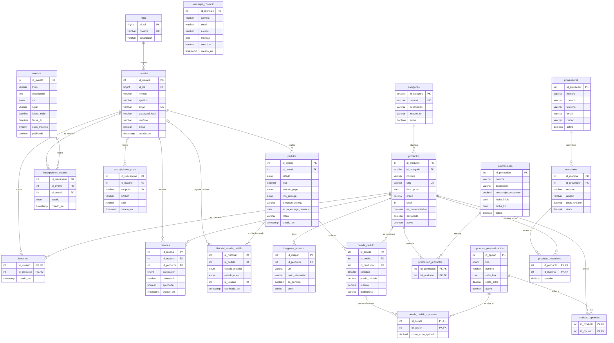

# Rosas Eternas: Modelo entidad-relación

Base de datos relacional en **MySQL 8 (Clever Cloud)**. El diagrama usa Mermaid; se visualiza en GitHub, VS Code (extensión Markdown Preview Mermaid) o en https://mermaid.live.

## Diagrama

## Entidades

| Entidad | Propósito |
|---|---|
| `roles` | Perfiles de acceso (administrador, cliente). |
| `usuarios` | Cuentas de clientes y administradores. |
| `categorias` | Agrupan productos (ramos, rosas individuales, cajas, etc.). |
| `productos` | Catálogo de regalos. |
| `imagenes_producto` | Galería de fotos de cada producto. |
| `opciones_personalizacion` | Colores de cinta, empaques, tamaños y extras, con costo adicional. |
| `producto_opciones` | Qué opciones admite cada producto (N:M). |
| `promociones` / `promocion_productos` | Descuentos por fechas y productos incluidos (N:M). |
| `pedidos` | Encabezado del pedido: cliente, estado, entrega, pago y total. |
| `detalle_pedido` | Productos del pedido con cantidad, precio al momento de la compra y dedicatoria. |
| `detalle_pedido_opciones` | Opciones elegidas en cada ítem, con el costo extra aplicado en ese momento. |
| `historial_estado_pedido` | Bitácora de cambios de estado de cada pedido. |
| `favoritos` | Productos guardados por un usuario (N:M). |
| `resenas` | Calificaciones y comentarios, con aprobación del administrador. |
| `eventos` / `inscripciones_evento` | Ferias, talleres y bazares, con inscripción de usuarios. |
| `proveedores` / `materiales` | Aliados locales y los insumos que suministran. |
| `producto_materiales` | Receta: cantidad de cada material por producto (N:M), para calcular costos. |
| `mensajes_contacto` | Mensajes del formulario de contacto. |
| `suscripciones_push` | Dispositivos suscritos a notificaciones push de la PWA. |

## Decisiones de diseño

- **Precio histórico:** `detalle_pedido.precio_unitario` y `detalle_pedido_opciones.costo_extra_aplicado` guardan el valor del momento de la compra, así un cambio de precio posterior no altera pedidos antiguos.
- **Relaciones N:M** resueltas con tablas puente de llave primaria compuesta.
- **Borrado:** las imágenes, opciones y detalles se eliminan en cascada con su padre; los productos con ventas no se borran, se **desactivan** (`activo = 0`).
- **Carrito:** no tiene tabla; vive en el dispositivo hasta confirmar el pedido.
- **Normalización:** el modelo cumple 3FN. Los valores cerrados (estados, tipos) se modelan con `ENUM` por simplicidad.
